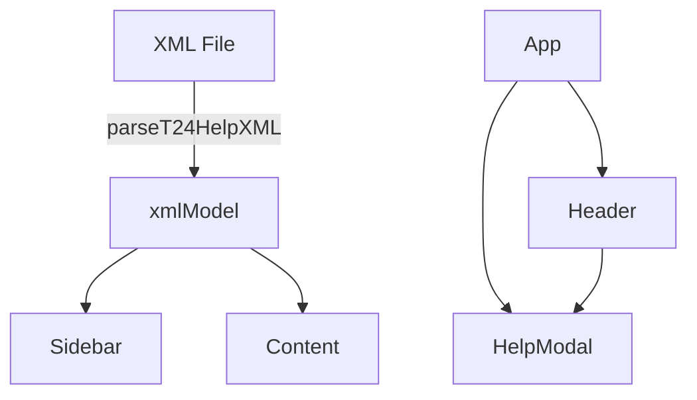

# XML Viewer Architecture

---

> This document describes the overall architecture, design principles, and main components of the XML Viewer application.

---

## Table of Contents

1. [Overview](#overview)
2. [Directory Structure](#directory-structure)
3. [Main Features](#main-features)
4. [Component Structure](#component-structure)
5. [Data Flow](#data-flow)
6. [State Management](#state-management)
7. [Markdown Rendering](#markdown-rendering)
8. [Styling](#styling)
9. [Extensibility](#extensibility)
10. [File Handling](#file-handling)
11. [Help Modal](#help-modal)
12. [Sandbox Mode](#sandbox-mode)
13. [References](#references)

---

## Overview

The XML Viewer is a modern, single-page React application designed for viewing, searching, and navigating T24 Help XML documentation. It supports drag-and-drop file loading, deep-linking, and a rich, interactive UI with in-app Markdown documentation.

---

## Directory Structure

```
xml-viewer/
├─ public/
│  └─ Docs/
│     ├─ readme.md
│     ├─ architecture.md
│     ├─ components.md
│     ├─ data_model.md
│     ├─ styling.md
│     ├─ testing.md
│     └─ troubleshooting.md
├─ scr/
│  ├─ app.jsx
│  ├─ index.css
│  ├─ main.jsx
│  ├─ components/
│  │  ├─ Header.jsx
│  │  ├─ Sidebar.jsx
│  │  ├─ Content.jsx
│  │  ├─ EmptyState.jsx
│  │  ├─ Diagnostics.jsx
│  │  ├─ HelpButton.jsx
│  │  ├─ HelpModal.jsx
│  │  └─ icons.jsx
│  ├─ hooks/
│  │  ├─ useTheme.js
│  │  └─ usePrefs.js
│  └─ lib/
│     ├─ parseT24HelpXML.js
│     ├─ utils.js
│     ├─ history.js
│     ├─ markdown.js
│     └─ docsIndex.js
├─ tailwind.config.js
├─ postcss.config.js
├─ index.html
└─ package.json
```

---

## Main Features

- **XML File Parsing**: Reads and parses T24 Help XML files.
- **Search & Filter**: Instant search across fields and paragraphs.
- **Sidebar Navigation**: Table of contents and anchor navigation.
- **Markdown Help Modal**: In-app documentation viewer with Markdown support.
- **Theme & Preferences**: Light/dark mode, font size, and layout options.
- **Responsive Design**: Works on desktop and mobile devices.

---

## Component Structure

| Component      | Responsibility                                 |
|----------------|------------------------------------------------|
| `App`          | Root, manages global state and layout          |
| `Header`       | Title, search, file info, actions, Help button |
| `Sidebar`      | Table of contents, anchors, navigation         |
| `Content`      | Main XML content rendering                     |
| `EmptyState`   | Shown when no file is loaded                   |
| `HelpModal`    | Modal for Markdown documentation               |
| `OptionsPanel` | User preferences (theme, font, width)          |

---

## Data Flow

1. **User loads XML** → `parseT24HelpXML` → `{product, table, overviewPs, entries[]}`.
2. App computes `filteredEntries` from `query`.
3. Sidebar emits anchor clicks → `onClickTOC` scrolls Content and pushes a hash (safe in sandbox).
4. IntersectionObserver sets `activeAnchor` and (safely) updates the hash while scrolling.
5. Options are persisted via `usePrefs` and rehydrate on load.



---

## State Management

- Uses React `useState`, `useEffect`, and custom hooks (`useTheme`, `usePrefs`).
- Centralized state in `App` for XML model, file meta, query, error, and modal state.
- Preferences (theme, font size, width) stored in context/hooks.

---

## Markdown Rendering

- Markdown files are auto-discovered from `/scr/docs`.
- Rendered using a custom parser (`renderMarkdown`) with Tailwind CSS classes for:
    - Headings (`#`, `##`, ...): styled and spaced
    - Lists (`-`, `1.`): indented and bulleted/numbered
    - **Bold**, *Italic*, ***Bold Italic***
    - Code blocks and inline code
    - Links and images
    - Blockquotes and tables
    - Horizontal rules

Example:

```markdown
## Example Markdown

- Bullet list
- **Bold text**
- `Inline code`
- [Link](https://github.com)
```

---

## Styling

- Uses [Tailwind CSS](https://tailwindcss.com/) for utility-first styling.
- Markdown content uses `prose` classes for readable documentation.
- Dark mode and responsive layouts supported.

---

## Extensibility

- Modular component structure.
- Easy to add new features (e.g., more file formats, new preferences).
- Markdown docs can be extended by adding `.md` files to `/scr/docs`.

---

## File Handling

- Supports drag-and-drop and file picker for XML files.
- File meta (name, size) shown in header.
- Deep-linking via URL hash for anchor navigation.

---

## Help Modal

- Help button (`?`) in header opens a modal.
- Modal lists all Markdown docs in `/scr/docs`.
- Selecting a doc loads and renders it in a scrollable, blocking overlay.
- Modal closes only via "Close ×" button or Escape key.
- Background scroll is locked while modal is open.

---

## Sandbox Mode

If the document URL is `about:srcdoc`, history mutations are disabled; we fall back to no‑ops / setting `location.hash`. Copy Link still works.

---

## References

- [React Documentation](https://react.dev/)
- [Tailwind CSS](https://tailwindcss.com/)
- [Vite](https://vitejs.dev/)
- [XML Viewer GitHub](https://github.com/)

---
