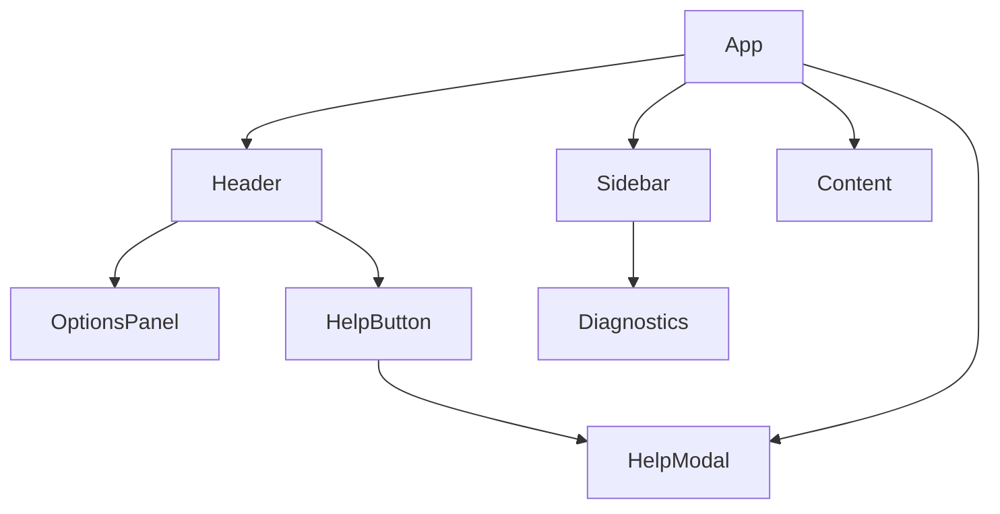

# Components

> This document describes the main React components in the XML Viewer application, their responsibilities, props, and interactions.

---

## Table of Contents

1. [App](#app)
2. [Header](#header)
3. [OptionsPanel](#optionspanel)
4. [Sidebar](#sidebar)
5. [Content](#content)
6. [Diagnostics](#diagnostics)
7. [HelpModal](#helpmodal)
8. [HelpButton](#helpbutton)
9. [EmptyState](#emptystate)
10. [Icons](#icons)
11. [Hooks](#hooks)

---

## App

**Role:**  
Root component. Manages global state: theme, preferences, XML model, search query, active anchor, error, and modal states. Handles file loading, drag-and-drop, and scroll events.

**Props:**  
_None_

**State:**  
- `theme`, `setTheme`
- `prefs`, `setCompact`, `setFontSize`, `setWidth`
- `xmlModel`, `fileMeta`
- `query`, `setQuery`
- `activeAnchor`, `setActiveAnchor`
- `error`
- `helpOpen`, `helpFiles`, `helpFile`, `helpContent`

**Emits:**  
- `onClickTOC(anchor)` (to scroll to section)
- `onHelp()` (to open Help modal)

---

## Header

**Role:**  
Top navigation bar. Displays title, product, table, search input, file info, theme switch, options, copy link, and Help button.

**Props:**  
- `title`, `product`, `table`
- `query`, `setQuery`
- `theme`, `setTheme`
- `onPickFile`
- `activeAnchor`
- `prefs`, `setCompact`, `setFontSize`, `setWidth`
- `fileMeta`
- `showHelp`, `onHelp`

**Features:**  
- File picker
- Search bar
- Theme toggle
- Options panel
- Copy link
- Help button (opens HelpModal)

---

## OptionsPanel

**Role:**  
Popover for user preferences (compact mode, font size, width).

**Props:**  
- `open`, `onClose`
- `prefs`, `setCompact`, `setFontSize`, `setWidth`

---

## Sidebar

**Role:**  
Displays table of contents (TOC) and diagnostics. Allows navigation between XML sections.

**Props:**  
- `xmlModel`
- `filteredEntries`
- `activeAnchor`
- `onClickTOC`
- `query`
- `compact`

---

## Content

**Role:**  
Renders XML overview and field sections as cards. Supports anchor navigation and copy-link per section.

**Props:**  
- `xmlModel`
- `sectionRefs`
- `contentRef`
- `query`
- `widthClass`
- `compact`
- `fontSize`

---

## Diagnostics

**Role:**  
Displays runtime diagnostics, such as parser results, validation rules, and slugify tests. Useful for debugging and demos.

**Props:**  
_None_

---

## HelpModal

**Role:**  
Blocking modal overlay for in-app documentation. Lists Markdown files from `/scr/docs`, renders selected file with Markdown styles.

**Props:**  
- `open`, `onClose`
- `files`, `file`, `setFile`
- `content`

**Features:**  
- Scrollable modal
- Locks background scroll
- Closes only via "Close ×" button or Escape key

---

## HelpButton

**Role:**  
Question mark icon button used in Header to open HelpModal.

**Props:**  
- `onClick`

---

## EmptyState

**Role:**  
Displays a placeholder when no XML file is loaded.

**Props:**  
_None_

---

## Icons

**Role:**  
SVG icon components used throughout the UI (Logo, Upload, Cog, Sun, Moon, Link, Search, X).

**Props:**  
_Varies per icon_

---

## Hooks

**Role:**  
Custom React hooks for theme and preferences.

- `useTheme`: manages light/dark mode
- `usePrefs`: manages compact mode, font size, width

---

## Component Interaction Diagram

---

## Extending Components

- Add new features by creating new components in `/scr/components`.
- Extend HelpModal by adding Markdown files to `/scr/docs`.
- Update OptionsPanel for more user preferences.

---

## References

- [React Documentation](https://react.dev/)
- [Tailwind CSS](https://tailwindcss.com/)
- [XML Viewer Architecture](./architecture.md)

---
